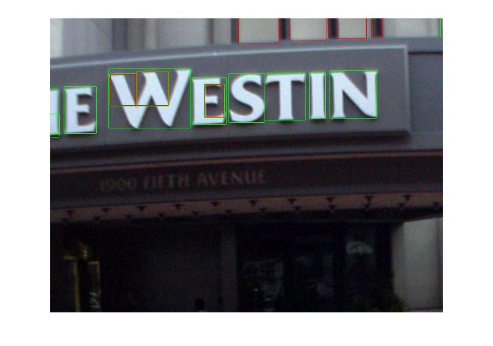

# Text detection in natural images   (An implementation of Stroke Width Transform)

## How to run
Run the file ``text_detector.m`` in Matlab. 
Parameters are defined and explained in the beginning of the script. 
Some output images are in the `./results` folder.

## Approaches
One way to detect text is by exploiting the property that they have a constant (or nearly constant) stroke width. An earlier approach to this is the SWT (Stroke Width Transform) algorithm which first detects all the edges from Canny Edge Detector; and then transforms it into another image where every pixel represents the width of the smallest stroke to which it belongs to.
Many conditions can be imposed to discard certain pixels depending upon the stroke width of themselves and their neighbours.
Then a flood-fill can be applied to group all these pixels into a character. Also height and width of the character can be found simultaneously by checking the extent of flood-fill.

## Challenges

 - The rays which are thrown from the edges does not necessarily fall perpendicular (or close) to the other side. So we are left with some gaps. Different components are shown in the figure. It would have been fine if all the components were connected, then the bounding rectangle (shown in red) would have been close to the character size.
But in most of the cases, a single flood-fill does not cover them all and they are treated as separate components and thus some of them get rejected (in the filtering stage).

 
<b>Flood fill covers all the components</b>

 
<b>Flood-fill does not connect the components</b>

 - Another problem faced was that the ray from one character was getting incident on another character. One way to solve this problem is to throw rays only in the inner direction. But I didn’t find any way to know that direction.  
 So for a set of all the connected edge points, rays are thrown in both direction (towards and opposite w.r.t gradient, to detect dark text on light surface and vice-versa). Then the variance of lengths (for consistent stroke width) is checked (separately for inwards and outwards rays). If it’s too large, then it’s not a stroke and hence all the rays are rejected.  
 We assume that the set of rays thrown outwards will have a very high variance and hence would be rejected. So, for a valid character, usually one set of rays will be taken (either inward or outward).

For the above figure (character A), it will still give the same stroke widths but this time the components are not needed to be connected visibly. The set of rays in a single pass belongs to a single character. Height and width of the character can be known while tracing all the connected edge pixels.

 - There are still some pixels which do not have the actual stroke width.
Consider the diagram below. The BLUE and GREEN pixels have a stroke width of 6 assigned by vertical and horizontal rays respectively. Pixels in the RED area do not have stroke width as 6 (instead 35, which is min(35,40)) because there is no ray of length 6 passing from there. This change in the small area will increase the variance too much. So, we set their stroke width as the median stroke width of all the pixels (i.e. 6).
There is a limit to the ratio of the number of pixels above a particular threshold (say 10 here) to total pixels (i.e. red area/total area) to ensure that there are only few pixels with such values.

 
<b>Pixels in the red area do not  
have the actual stroke width</b>

 - The canny edge detector detects lots of random and small edges (though not steep) in the leaves of the tree. So, the algorithm found many strokes there.
To distinguish text from leaf edges, a threshold can be given to the edge detector. This restriction removed most of the false positives from the leaves but also arose some false negatives. Some characters left undetected, so some trade-off had to be made.
Still, gaps within the leaves (open sky) area are detected as light strokes over dark background because intensity change is very much.

 - The algorithm gives false positives in orthogonal and wide objects like doors, window, pillars, walls of tall building etc.

## Limitations
 - Filtering is needed to be much more accurate. It does not detect some characters if they are blurred because of the threshold to avoid detection of leaves. Perhaps threshold can be learnt from the image e.g. it might have a low value for any image having no noise structures like leaves. A lower limit to the height and width of the character can be imposed to decrease the detection of such gaps.

 - Currently, it detects individual characters. They are supposed to be grouped to form a word.

## Results
Following are some output images. Red rectangles indicate dark text over light background and green ones the opposite.

<b>Perfect results for basic images (irrespective of font, size and color)</b>

<b>Results for natural images</b> 

## References
 - **Detecting Text in Natural Scenes with Stroke Width Transform*** by Boris Epshtein, Eyal Ofek and Yonatan Wexler*
 - **Digital Image Processing*** by Rafael C. Gonzales and Richard E. Woods*

